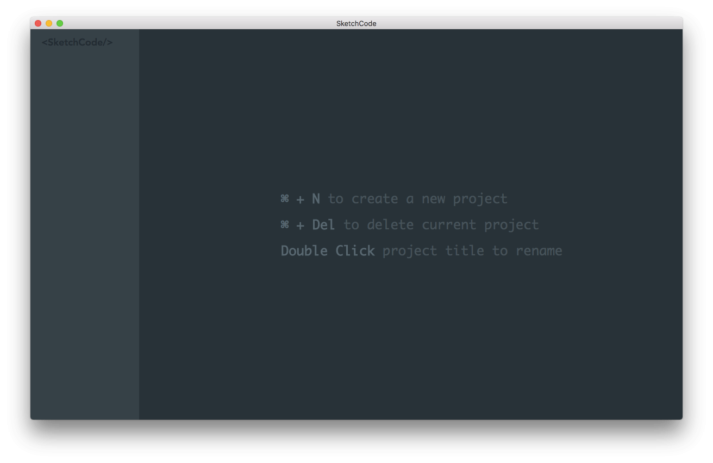

# SketchCode




`Vue` + `Electron` = `<SketchCode/>`

## Development

```
cd app
yarn
yarn dev

cd ../electron
yarn
yarn start
```

## Production (tested on macOS only)

```
cd app
yarn build

cd ../electron
yarn package
```
