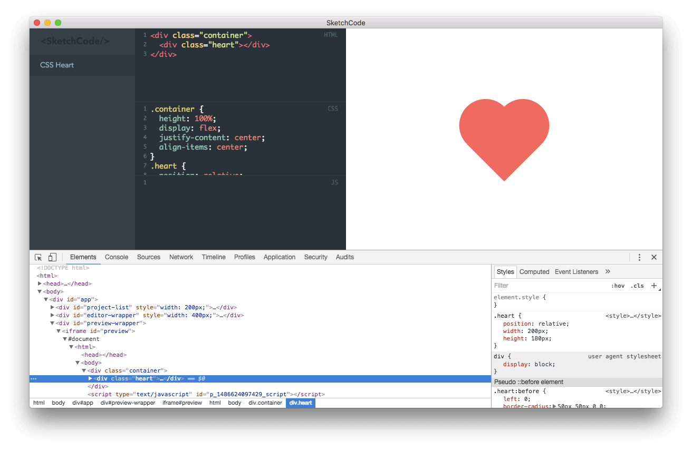
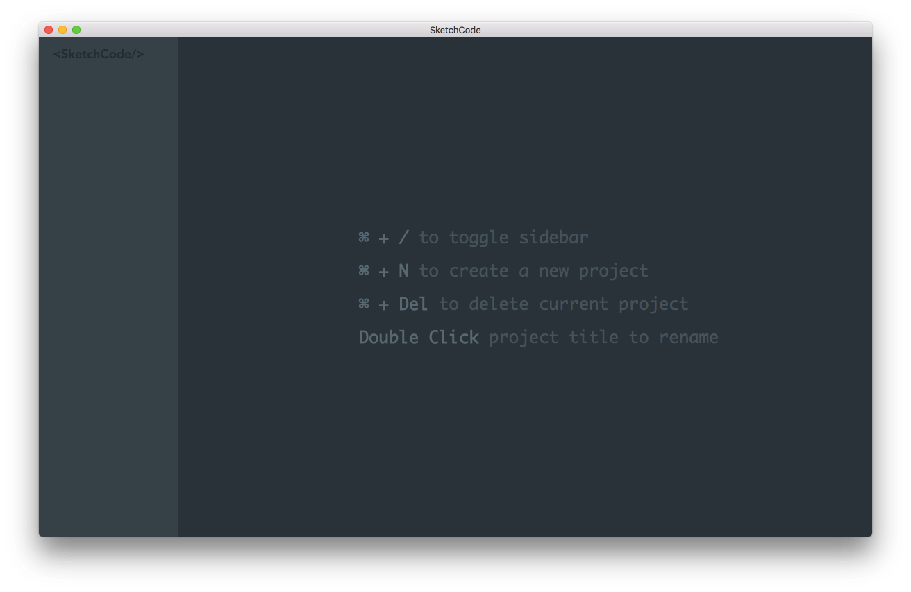

# SketchCode





`Vue` + `Electron` = `<SketchCode/>`

## Development in browser

```
cd app
yarn
yarn dev
```

## Test application

```
cd app
yarn
yarn build

cd ../electron
yarn start
```

## Production (tested on macOS only)

```
cd app
yarn build

cd ../electron
yarn build
```

=====

<p align="center"></p>
